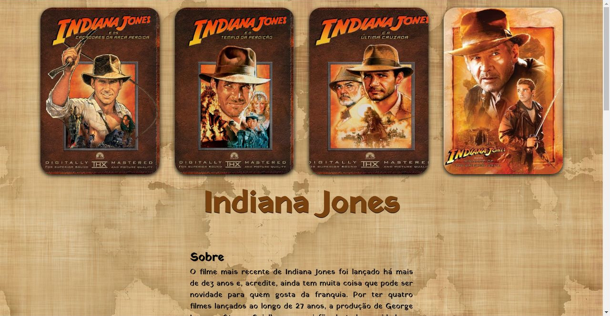
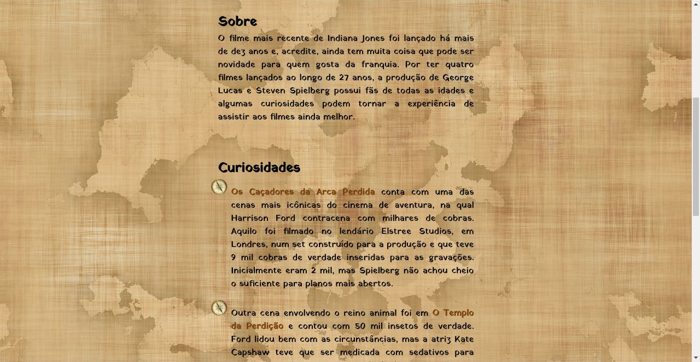
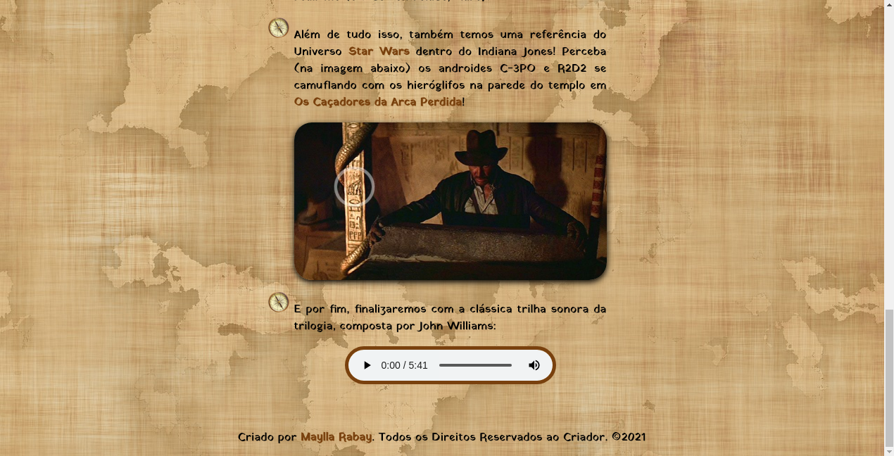

<h1 align="center">
  
</h1>

<h2 align="center"> 
	🚀 Curiosidades sobre Filme Favorito 🚀
</h2>

## 💻 Sobre o projeto
  Site com algumas curiosidades sobre minha franquia de filmes favorita. Criado para melhorar meu conhecimento em HTML e CSS. Segue as instruções para praticar:

    Crie um site sobre as curiosidades de algum filme com a seguinte estrutura:

    - div.card-principal
      - img com altura (*height*) máxima de 500px
      - h1
    - div.card-curiosidades
      - h2
      - ul
        - li

    Você deverá encontrar curiosidades do filme (se isso não for possível, coloque na lista de curiosidades os atores, atrizes, direção do filme, etc) e músicas, bandas ou albums sobre o tema do filme (se isso não for possível coloque a trilha sonora).

    Estilize a página com cores e fontes que façam sentido com o cartaz do filme.

    Seja criativo e não limite-se aos estilos obrigatórios, tente mudar o estilo da lista, dos links, etc.

## 🎨 Layout
  Design próprio, com imagens retiradas da internet e editadas no GIMP. Cores utilizadas:
  - rgb(167, 102, 41) (marrom)
  - rgb(121, 65, 14) (marrom escuro)
  - black (preto)

## 🛠 Tecnologias
  - 
  - 

Feito com ❤️ por Maylla Rabay 👋 [Entre em contato!](https://www.linkedin.com/in/mayllarabay/)

